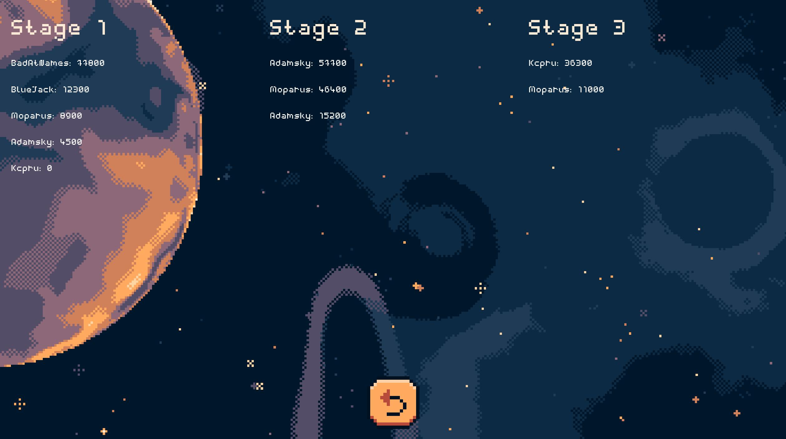

- [Uruchomienie gry](#uruchomienie-gry)
  - [Windows](#windows)
  - [Ubuntu](#ubuntu)
- [Ekran startowy](#ekran-startowy)
- [Ekran zapisów](#ekran-zapisów)
- [Ranking](#ranking)
- [Wybór mudułów](#wybór-mudułów)
  - [Moduł pierwszy](#moduł-pierwszy)
    - [Opis modułu pierwszego](#opis-modułu-pierwszego)
  - [Moduł drugi](#moduł-drugi)
    - [Opis modułu drugiego](#opis-modułu-drugiego)
  - [Moduł drugi](#moduł-drugi-1)
    - [Opis modułu drugiego](#opis-modułu-drugiego-1)
- [Interfejs w trakcie rozgrywki](#interfejs-w-trakcie-rozgrywki)
  - [Menu Pauzy](#menu-pauzy)
  - [Ekran końcowy](#ekran-końcowy)
- [Rodzaje broni](#rodzaje-broni)
- [Artefakty](#artefakty)
- [Sterowanie](#sterowanie)
- [Konsola](#konsola)

___
# Uruchomienie gry
## Windows
Do pobrania.
## Ubuntu
Do pobrania.

# Ekran startowy

| Ikona                                                                    | Opis                                         |
| ------------------------------------------------------------------------ | -------------------------------------------- |
|       | Przejście do wyboru modułów.                 |
|        | Przejście do zapisanych wcześniej rozgrywek. |
|  | Wyświetlenie tablicy wyników.                |
|         | Wyjście z gry.                               |

# Ekran zapisów 

| Ikona                                                                 | Opis                               |
| --------------------------------------------------------------------- | ---------------------------------- |
|    | Kontynuowanie zapisanej rozgrywki. |
|  | Usunięcie zapisanej rozgrywki.     |
|      | Cofnięcie do ekranu startowego.    |

# Ranking 

| Ikona                                                             | Opis                            |
| ----------------------------------------------------------------- | ------------------------------- |
|  | Cofnięcie do ekranu startowego. |

# Wybór mudułów

| Ikona                                                                             | Opis                            |
| --------------------------------------------------------------------------------- | ------------------------------- |
|  | Przejście do modułu pierwszego. |
|     | Przejście do modułu drugi.      |
|    | Przejście do modułu trzeciego.  |
|                  | Cofnięcie do ekranu startowego. |

## Moduł pierwszy

| Ikona                                                                             | Poziom trudności |
| --------------------------------------------------------------------------------- | ---------------- |
|       | Łatwy            |
|  | Normalny         |
|      | Trudny           |

### Opis modułu pierwszego
Rozpoczęcie rozgrywki skutkuje wylosowaniem puli map z wybranego poziomu trudności.
Moduł polega na przejściu jak największej ilości plansz, w celu uzyskania największego wyniku. Strata wszyskich żyć skutkuje zakończeniem rozgrywki. Wynik jest dodawany do rankingu. 

## Moduł drugi

| Ikona                                                                                | Poziom trudności                         |
| ------------------------------------------------------------------------------------ | ---------------------------------------- |
|  | Następny poziom.                         |
|    | Poprzedni poziom.                        |
|                   | Rozpoczęcie rozgrywki na wybranej mapie. |

### Opis modułu drugiego
Moduł drugi umożliwia wybór jednej z ponad 15 plansz. Po przejściu planszy ładowana jest kolejna. W module tym występują urozmaicenia w formie spadających broni. Strata wszyskich żyć skutkuje zakończeniem rozgrywki. Wynik jest dodawany do rankingu. 

## Moduł drugi

| Ikona                                                                                | Poziom trudności                         |
| ------------------------------------------------------------------------------------ | ---------------------------------------- |
|  | Następny poziom.                         |
|    | Poprzedni poziom.                        |
|                   | Rozpoczęcie rozgrywki na wybranej mapie. |

### Opis modułu drugiego
Moduł trzeci posiada 5 ekskluzywnych poziomów przygotowanych specjalnie do tego trybu. Na planszach pojawiają się ułatwienia w postaci spadających artefaktów. Strata wszystkich żyć skutkuje zakończeniem rozgrywki. Celem trybu gry jest uzyskanie najwyższego wyniku. Wynik dodawany jest do rankingu.

# Interfejs w trakcie rozgrywki

| Ikona     | Opis                                          |
| --------- | --------------------------------------------- |
| Serce     | Ilość żyć na dany poziom.                     |
| Magazynek | Pokazuje kiedy broń jest gotowa do wystrzału. |
| Score     | Wynik rozgrywki.                              |
| Pauza     | Pauzuje grę.                                  |

## Menu Pauzy

| Ikona                                                                   | Opis                                                          |
| ----------------------------------------------------------------------- | ------------------------------------------------------------- |
|      | Wznawia grę.                                                  |
|        | Powrót do menu głównego. __Stan rozgrywki zostaje zapisany.__ |
|  | Zakończenie gry.                                              |

## Ekran końcowy

| Ikona                                                                 | Opis                                                                   |
| --------------------------------------------------------------------- | ---------------------------------------------------------------------- |
| Your nick                                                             | Pozwala na wpisanie nazwy gracza w celu dołączenia wyniku do rankingu. |
|  | Dodaje wynik do rankingu oraz przenosi do ekranu startowego.           |

# Rodzaje broni
| Ikona                                                                    | Nazwa   | Opis                                                                                              |
| ------------------------------------------------------------------------ | ------- | ------------------------------------------------------------------------------------------------- |
|      | Gun     | Broń podstawowa, która wystrzeliwuje pojedyncze pociski. Cechuje się szybkostrzelnością.          |
|  | Shotgun | Broń dodatkowa, która wystrzeliwuje 3 pociski jednocześnie.                                       |
|      | RPG     | Broń dodatkowa, wystrzeliwuje jedną rakietę, która w momencie wybuchu zadaje obszarowe obrażenia. |
|    | Laser   | Broń dodatkowa, wystrzeliwuje wiązkę laseru, która anihiluje wszystkie. __Nie niszczy szkła__.    |

# Artefakty
| Ikona                                                                      | Nazwa             | Opis                                                                                     | Czas trwania |
| -------------------------------------------------------------------------- | ----------------- | ---------------------------------------------------------------------------------------- | ------------ |
|                  | Bonusowe życie    | Artefakt zwiększający ilość żyć.                                                         | -            |
|                  | Zatrzymanie czasu | Artefakt zatrzymuje czas poruszania się piłek.                                           | 5s           |
|              | Kauczuk           | Artefakt zwiększający sprężystość piłek, umożliwiający łatwiejsze przemknięcie pod nimi. | 10s          |
|  | Przyspieszenie    | Artefakt zwiększający prędkość ruchu gracza.                                             | 10s          |

# Sterowanie
| Przycisk             | Działanie                     |
| -------------------- | ----------------------------- |
| Strzałka w lewo / A  | Przesuwa gracza w lewo.       |
| Strzałka w prawo / D | Przesuwa gracza w prawo.      |
| Strzałka w górę / W  | Gracz wspina się po drabinie. |
| Strzałka w dół / S   | Gracz schodzi po drabinie.    |
| Spacja / Enter       | Oddanie strzału.              |

# Konsola
Dostępna po naciśnięciu kombinacji klawiszy: `Ctrl + ~`

| Polecenie         | Argumenty                                            | Opis                                          |
| ----------------- | ---------------------------------------------------- | --------------------------------------------- |
| `save`            |                                                      | Zapisuje stan rozgrywki.                      |
| `load`            |                                                      | Wczytuje stan rozgrywki.                      |
| `spawn_ball`      | Rozmiar piłki [int]                                  | Tworzy piłkę.                                 |
| `nuke`            |                                                      | Zadaje wszystkim piłkom pojedyncze obrażenie. |
| `set_lives`       | Ilość żyć [int]                                      | Ustawia ilość żyć.                            |
| `give_weapon`     | `gun` / `rpg` / `shotgun` / `laser`                  | Zmienia broń.                                 |
| `timescale`       | Mnożnik czasu [float]                                | Ustawia szybkość gry.                         |
| `add_score`       | Nick [string], Punkty [int], Moduł [`1` / `2` / `3`] | Dodaje punkty.                                |
| `switch_to_scene` | Ścieżka do sceny [string]                            | Przełącza scenę.                              |
| `commands`        |                                                      | Wyświetla listę poleceń.                      |